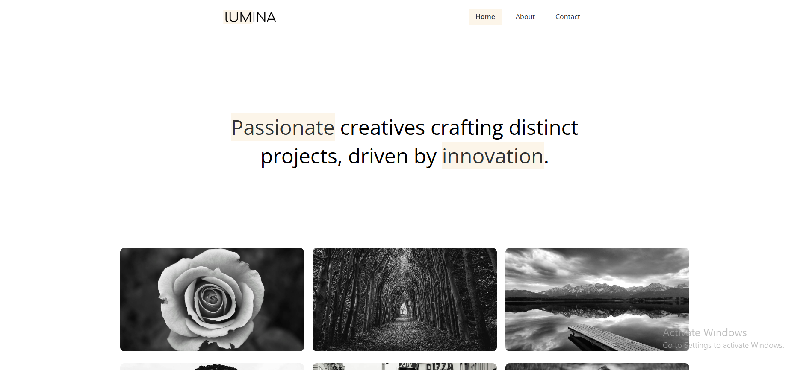

   
    
   

  

    
    
    
  

  <h3 align="center">Lumina Creative</h3>

   

     Lumina Creative is a sleek and modern personal portfolio website designed for a creative agency. It showcases the agency’s work, values, and services with a strong visual identity and user-centric design. Built to impress potential clients and partners, Lumina Creative blends aesthetics with functionality for a seamless digital presence.
    

